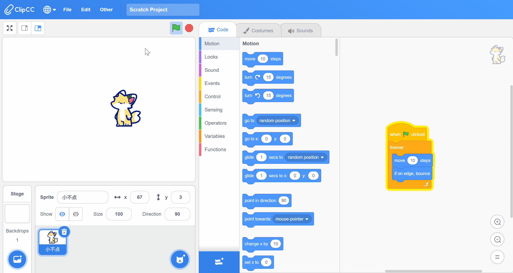

# Custom FPS
This feature can provide a smoother display experience for animation and game projects.

## Usage
For version lower than 3.2, you can click "Other" -> "Settings" to set FPS.
For version 3.2 and above, just click "Settings".

## Tips
1. This feature will break the project that without V-Sync support. The most typical feature is that your animations and games will become significantly faster. A possible solution is detecting the FPS and adjusting the speed of the movement according to it.
2. You shouldn't use this feature to speed up your calculations, please use "Turbo Mode" instead.
3. The legal values for this feature are 10 to 240. too low and too high values can disrupt the Scratch's VM.

| Introduced | Features Compatibility | Project Compatibility |
| ---- | ---- | ---- |
| 3.0 | ClipCC-only | No Impact |